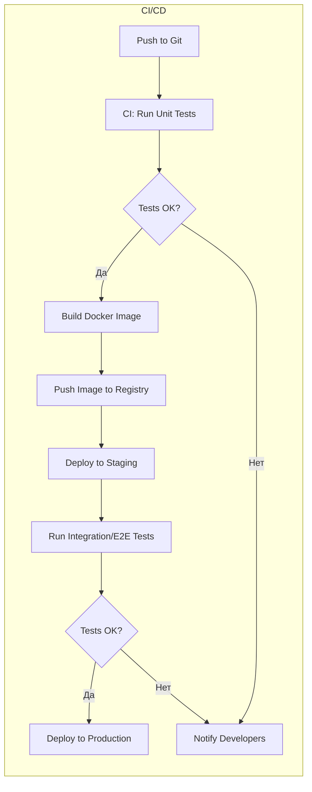
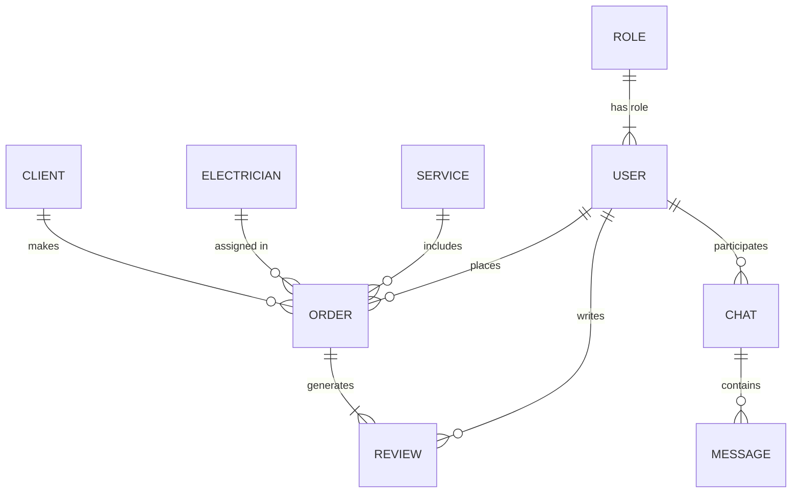

# Executive Summary

Сайт электромонтажных услуг нацелен на привлечение **заказчиков бытовых и коммерческих услуг электрика** и обеспечение удобной коммуникации с исполнителями (электриками, бригадами). Целевую аудиторию составляют владельцы жилья и офисов, бизнес-клиенты (офисные и торговые помещения), а также строительные компании – другими словами, **практически все платежеспособные граждане**, которым нужны электромонтаж или ремонт электрооборудования【5†L19-L22】. Главная цель проекта – генерация лидов и заявок на услуги (онлайн-бронирование работ, расчёт стоимости). Ключевые метрики успеха включают: количество **лидов** и их конверсию в клиентов (MQL/SQL)【11†L130-L138】【11†L164-L172】, коэффициент конверсии сайта (CR)【11†L158-L166】, глубину просмотра и время на сайте, показатели отказов (bounce rate)【11†L130-L138】. Также важно отслеживать качественные метрики: **рейтинг исполнителей**, рост трафика (SEO) и доступность сервиса (uptime).

## Функциональные требования

- **Страницы сайта:** «Главная» (презентация компании/услуг), «Услуги» (детали электромонтажных работ), «Прайс/Калькулятор» (расчёт стоимости работ), «Портфолио» (примеры выполненных объектов), «Блог/Новости» (статьи о ремонте, советы), «Контакты» (адрес, форма заявки). На всех страницах – **призыв к действию** (заказ звонка, формы заявки) и видимая контактная информация.
- **Роли пользователей:** гость (неавторизованный), клиент (заказчик услуг), электрик/мастер (исполнитель), администратор. На сайте будут реализованы **разные интерфейсы** для клиентов и мастеров: клиенты могут искать и заказывать услуги, видеть статус заявки; мастера – заполнять профиль, принимать и вести заказы. Админ-панель позволяет управлять контентом сайта, пользователями и заявками.
- **Регистрация/Авторизация:** вход и регистрация по e-mail/телефону с подтверждением (двухфакторно или SMS). Возможна авторизация через соцсети (VK, Google) для удобства. Пароли – хэшируются, доступ через безопасные протоколы (HTTPS). Роли назначаются при регистрации или в админке.
- **Поиск мастеров:** фильтрация по специализации, геолокации, рейтингу. Карта (Yandex.Maps/Google Maps) с размещением мастерских или зон работы мастеров. Быстрая сортировка (по цене, опыту, рейтингу).
- **Онлайн-запись/калькулятор стоимости:** клиент вводит параметры работ (площадь, задачи, материалы) – система рассчитывает примерную стоимость или оставляет заявку с описанием. Затем формируется заявка/заказ на определённую дату/время. Включает выбор слотов (календарь доступности мастеров). Для повышения удобства – интеграция с SMS/Email-уведомлениями о статусах заявки.
- **Чат и обратная связь:** встроенный **чат** между клиентом и мастером для уточнения деталей заказа, с уведомлениями. Форма обратной связи на сайте (звонок, email) с автоответами. Возможность оставить отзыв или задать вопрос через мессенджеры (Telegram) или веб-чат.
- **Отзывы и рейтинги:** клиенты оставляют **отзывы и оценки** мастеров после завершения заказа. Механизм предотвращения фальшивых отзывов – только после выполнения заказа и подтверждения. Вывод средней оценки на профиле мастера и в поиске.
- **Платежи:** подключение платёжного шлюза (ЮKassa, Tinkoff, Stripe) для онлайн-оплаты услуг и аванса【39†L169-L175】. Комиссия – от 0,4% (ЮKassa)【39†L169-L175】. Обязательна интеграция с онлайн-кассой (54-ФЗ) при безналичной оплате.
- **Интеграция с CRM:** автоматическая передача заявок в CRM (Bitrix24, amoCRM) для учёта клиентов и работы отдела продаж. Двусторонняя синхронизация статусов заказа между сайтом и CRM.
- **Админ-панель:** закрытый интерфейс для администраторов – управление пользователями (утверждение/блокировка аккаунтов мастеров), усло- виями и ценами, портфолио и контентом блога, обзора заявок, модерации отзывов. Статистика заявок и выручки.
- **SEO и мультиязычность:** SEO-оптимизация страниц (мета-теги, ЧПУ, микроразметка «Breadcrumb» и т.д.) для продвижения (после конктретизации целевого региона – можно добавить английскую версию и другие языки). Обязателен русский язык. Добавить карту сайта, robots.txt. Адаптивная верстка для всех устройств.
- **Безопасность и соответствие локальным требованиям:** HTTPS, защита от CSRF/XSS-инъекций, брутфорс-атак, SQL-инъекций. Регулярное обновление зависимостей. Хранение паролей только в виде хэшей. Для GDPR/152-ФЗ: **политика конфиденциальности и согласие на обработку ПДн** должны быть доступны (в «подвале» сайта)【32†L1-L4】【32†L9-L12】. Под каждую форму обратной связи выводить чекбокс согласия. Реализовать cookie-баннер для уведомления о файлов cookie.

## Нефункциональные требования

- **Производительность:** время загрузки страниц – не более 2–3 сек (оптимизация изображений, кэширование, CDN); система должна обслуживать одновременно _не менее 1000 активных пользователей_ без деградации (P-1 требование)【26†L39-L45】. Настроить таймауты API, оптимизировать запросы (индексы БД).
- **Масштабируемость:** архитектура должна позволять горизонтальное и вертикальное масштабирование: использовать кластеризацию или контейнеризацию (Docker/Kubernetes). Возможность перераспределения нагрузки при пиковых посещениях (праздники, аварии).
- **Доступность:** целевое время безотказной работы – ≥99.9% (SLA). Резервирование ключевых сервисов (например, фоновые задачи, очереди). Мониторинг производительности в режиме реального времени. Настроить алертинг при падении сервиса.
- **Надёжность и отказоустойчивость:** ежедневное резервное копирование БД и контента; возможность быстрого восстановления (RPO не более 1 дня). Репликация БД (горячий standby) для минимизации простоев.
- **Безопасность и контроль качества:** автоматизированное и ручное тестирование (см. раздел «Тестирование»). Все экспонируемые API должны иметь ограничение частоты запросов (Rate Limit). Логи системы (доступ, ошибки) централизованно собираются для аудита.

## Рекомендуемый технологический стек

| **Компонент**              | **Основной выбор**                                   | **Альтернатива**                            | **Плюсы/Минусы**                                                                                                                                                                                                                                                    |
| -------------------------- | ---------------------------------------------------- | ------------------------------------------- | ------------------------------------------------------------------------------------------------------------------------------------------------------------------------------------------------------------------------------------------------------------------- |
| **Фронтенд**               | React + TypeScript + Next.js (SSR/SSG)               | Vue.js + Nuxt.js                            | React: большая экосистема, гибкость, Next.js поддерживает SSR/SEO【21†L102-L110】【21†L123-L130】. Vue: проще вход, хорошие средства SEO (Nuxt)【21†L123-L130】. Angular: слишком тяжеловесен для средних проектов (не включён).                                    |
| **Бэкенд**                 | Node.js (NestJS/Express) или Python (Django/FastAPI) | Java (Spring Boot), Go (Gin), PHP (Laravel) | Node.js: единый язык с фронтом, хорош для real-time, API【18†L408-L418】; Python: быстрый старт, мощные фреймворки (Django – с админкой)【18†L381-L389】. Java/Spring: очень надёжен, но требует больше ресурсов. Go: высокая производительность для микросервисов. |
| **База данных**            | PostgreSQL                                           | MySQL/MariaDB, MongoDB                      | PostgreSQL: надёжность и транзакции, хорошо масштабируется. MySQL: проще хостинг. MongoDB: «NoSQL», гибкая схема (для быстрого прототипирования).                                                                                                                   |
| **Хостинг/Инфраструктура** | Облако (AWS, GCP или Azure) + Docker/Kubernetes      | VPS (DigitalOcean, Hetzner)                 | Облако: сервисы управления (RDS, S3, ECS/EKS), автошкалирование. Kubernetes: гибкое управление контейнерами, сложнее в настройке【35†L19-L22】【35†L145-L148】. VPS: дешевле, но требует ручного администрирования.                                                 |
| **CI/CD, контейнеризация** | GitHub Actions/GitLab CI, Docker                     | Jenkins + Docker, Docker Compose            | GitHub/GitLab CI: простая настройка пайплайна из репозитория. Docker: унификация окружения. Продвинутый вариант – Kubernetes для автоматического деплоя.                                                                                                            |
| **Дополнительно:**         | Redis (кеш, очереди)                                 | RabbitMQ/Kafka (для сообщений)              | Redis: быстрый кеш и простая PUB/SUB для уведомлений.                                                                                                                                                                                                               |

_Обоснование:_ Стек выбирается исходя из скорости разработки и надёжности. React с Next.js позволяет быстро сделать SEO-френдли интерфейс【21†L102-L110】【21†L123-L130】. Node.js или Django обеспечивают быстрое построение API с готовыми инструментами безопасности. PostgreSQL – стандарт для транзакционных данных. Контейнеризация (Docker/K8s) дает переносимость и упрощает масштабирование【18†L432-L441】【35†L19-L22】. При этом возможны альтернативы: например, Laravel+Vue (PHP) или .NET+Angular, если команда владеет этими технологиями.

## API-спецификация (высокоуровневая)

Точки REST API примерно следующие:

| **Endpoint**             | **Метод** | **Описание**                                                      | **Требует аутентификацию** |
| ------------------------ | --------- | ----------------------------------------------------------------- | -------------------------- |
| `/api/auth/register`     | POST      | Регистрация пользователя (клиент/мастер). Отправка подтверждения. | Нет                        |
| `/api/auth/login`        | POST      | Вход (по e-mail/паролю). Возвращает JWT-токен.                    | Нет                        |
| `/api/users/{id}`        | GET/PUT   | Получение/изменение профиля пользователя.                         | Да (только свой/админ)     |
| `/api/masters/search`    | GET       | Поиск мастеров по фильтрам (услуги, город, рейтинг).              | Нет                        |
| `/api/masters/{id}`      | GET       | Просмотр профиля мастера.                                         | Нет                        |
| `/api/bookings`          | GET/POST  | Создание и список заказов (записей).                              | Да (клиент/мастер)         |
| `/api/bookings/{id}`     | GET/PUT   | Детали заказа, изменение статуса (мастером/админом).              | Да                         |
| `/api/chat/{bookingId}`  | GET/POST  | Чат сообщений по заказу.                                          | Да                         |
| `/api/reviews`           | POST      | Добавление отзыва (после выполнения заказа).                      | Да                         |
| `/api/payments/checkout` | POST      | Инициация платежа через шлюз.                                     | Да                         |
| `/api/admin/...`         | \*        | Инструменты админ-панели (управление сущностями).                 | Да (роль: админ)           |

_Форматы данных:_ JSON, аутентификация – токены (JWT/OAuth). Документация может вестись в OpenAPI/Swagger.

## Структура базы данных (ER-диаграмма)

Где ключевые сущности и атрибуты (приведены примеры полей):

| **Таблица `users`** | **Тип**      | **Описание**            |
| ------------------- | ------------ | ----------------------- |
| `id` (PK)           | serial       | Идентификатор           |
| `email`             | varchar(255) | Логин (почта)           |
| `password_hash`     | varchar      | Хэш пароля              |
| `name`              | varchar(100) | Имя пользователя        |
| `role_id` (FK)      | int          | Ссылка на таблицу ролей |

| **Таблица `roles`** | **Тип**     | **Описание**                          |
| ------------------- | ----------- | ------------------------------------- |
| `id` (PK)           | serial      | Идентификатор роли                    |
| `name`              | varchar(50) | Название роли (Client, Master, Admin) |

| **Таблица `services`** | **Тип**       | **Описание**         |
| ---------------------- | ------------- | -------------------- |
| `id` (PK)              | serial        | Идентификатор услуги |
| `title`                | varchar(100)  | Название услуги      |
| `description`          | text          | Описание услуги      |
| `base_price`           | numeric(10,2) | Базовая стоимость    |

| **Таблица `orders`** | **Тип**       | **Описание**                        |
| -------------------- | ------------- | ----------------------------------- |
| `id` (PK)            | serial        | Идентификатор заказа                |
| `client_id` (FK)     | int           | Клиент (пользователь)               |
| `master_id` (FK)     | int           | Назначенный мастер                  |
| `service_id` (FK)    | int           | Тип услуги                          |
| `status`             | varchar(50)   | Статус заказа (Pending, Done, etc.) |
| `price`              | numeric(10,2) | Итоговая цена                       |
| `scheduled_at`       | timestamp     | Дата и время записи                 |

| **Таблица `reviews`** | **Тип**  | **Описание**          |
| --------------------- | -------- | --------------------- |
| `id` (PK)             | serial   | Идентификатор отзыва  |
| `order_id` (FK)       | int      | Связь с заказом       |
| `author_id` (FK)      | int      | Автор отзыва (клиент) |
| `master_id` (FK)      | int      | Мастер (получатель)   |
| `rating`              | smallint | Оценка (1–5)          |
| `comment`             | text     | Текст отзыва          |

| **Таблица `chats`** | **Тип** | **Описание**             |
| ------------------- | ------- | ------------------------ |
| `id` (PK)           | serial  | Идентификатор чата       |
| `order_id` (FK)     | int     | Заказ (для которого чат) |
| `client_id` (FK)    | int     | Клиент                   |
| `master_id` (FK)    | int     | Мастер                   |

| **Таблица `messages`** | **Тип**   | **Описание**               |
| ---------------------- | --------- | -------------------------- |
| `id` (PK)              | serial    | Идентификатор сообщения    |
| `chat_id` (FK)         | int       | Чат, к которому относится  |
| `sender_id` (FK)       | int       | Отправитель (пользователь) |
| `content`              | text      | Текст сообщения            |
| `sent_at`              | timestamp | Время отправки             |

(И другие: `payments`, `admins` и т.д. по аналогии.)

## План разработки и таймлайн

| **Фаза**                                          | **Человеко‑часы** | **Описание/Задачи**                                   | **Приоритет** |
| ------------------------------------------------- | ----------------- | ----------------------------------------------------- | ------------- |
| Анализ и проектирование                           | 40 ч              | Сбор требований, прототипирование (UX/UI), ТЗ         | 1 (высокий)   |
| Дизайн интерфейса                                 | 60 ч              | Проработка макетов главных экранов, адаптивный дизайн | 1             |
| Разработка API и БД                               | 160 ч             | Моделирование БД, реализация серверных эндпоинтов     | 1             |
| Разработка фронтенда                              | 140 ч             | Верстка страниц, интеграция с API, реализация UI/UX   | 1             |
| Разработка дополнительных модулей (чат, платёжка) | 80 ч              | Интеграция чата, платёжного шлюза, SMS-рассылки       | 2 (средний)   |
| Тестирование (QA)                                 | 60 ч              | Написание и запуск юнит, интеграционных, e2e тестов   | 1             |
| Деплой и настройка                                | 40 ч              | Настройка CI/CD, хостинга, SSL, мониторинга           | 2             |
| Буфер (непредвиденное)                            | 20 ч              | Резерв на исправление багов, доработки                | 2             |
| **Итого:**                                        | **600 ч**         |                                                       |               |

Задачи с высоким приоритетом (1) – ядро функционала (регистрация, поиск, бронирование). Средний – вспомогательные (чат, интеграции).

## Примеры задач для Sprint Backlog с критериями приёмки

- **Регистрация пользователя:** _Task:_ реализовать форму регистрации клиента/мастера. _Acceptance:_ после заполнения полей (имя, e-mail, пароль) пользователь получает письмо для подтверждения и может войти; данные сохраняются в БД. Пароль шифруется.
- **Поиск мастеров:** _Task:_ реализовать эндпоинт `/api/masters/search` и фронтенд-страницу. _Acceptance:_ при вводе фильтров (город, услуга) выводится список мастеров с фото, именем, рейтингом; запрос на сервер возвращает корректный JSON.
- **Онлайн-запись:** _Task:_ создать форму заказа/калькулятора. _Acceptance:_ пользователь выбирает услугу и дату, заполняет контактные данные, система рассчитывает цену и отправляет заявку мастеру и администратору (SMS/Email-уведомление).
- **Админ-панель — управление контентом:** _Task:_ реализовать раздел «Услуги» в админке (CRUD). _Acceptance:_ админ может добавить/изменить/удалить услугу, изменения отражаются на публичном сайте.
- **Оплата заказа:** _Task:_ интегрировать YooKassa. _Acceptance:_ клиент по кнопке «Оплатить» попадает на платежную форму; после успешного платежа заказу присваивается статус «Оплачено» в системе.

Каждая задача описывается со сценариями (Given/When/Then) и тестами.

## Тестирование

- **Unit-тестирование:** покрытие ключевых модулей (моделей, утилит, компонентов). Использовать фреймворки типа Jest (JS), Pytest (Python) или PHPUnit. Написать тесты на все базовые бизнес-методы.
- **Интеграционное тестирование:** проверка взаимодействия фронтенда и API. Инструменты: Postman или тестовые раннеры (Cypress). Например, сценарий «создание заказа» – фронт делает запрос, сервер записывает в БД и возвращает ожидаемый JSON. Также тесты на отказоустойчивость (имитация ошибок БД, таймаутов).
- **E2E-тесты:** полное тестирование «с головы до ног» через UI (Cypress/Selenium). Например, пользователь регистрируется, ищет мастера, оформляет заказ и оплачивает – весь сценарий должен успешно проходить.
- **Нагрузочное тестирование:** имитация одновременных запросов (Apache JMeter, Locust). Например, проверка устойчивости при **500 параллельных пользователей**: измерить время ответа и процент ошибок【29†L142-L150】.
- **Регрессионное тестирование:** после изменений – запуск набора юнит/интеграционных тестов, чтобы убедиться, что ничего не сломалось.

## Требования к безопасности и чек‑лист

- **Шифрование:** вся передача данных – только по HTTPS (SSL/TLS). Хранение паролей – только в виде защищённых хэшей (bcrypt). При необходимости – использовать двухфакторную аутентификацию.
- **Защита данных:** выполнение OWASP Top-10: валидация и экранирование всех входных данных (XSS), применение CSRF-токенов, ограничение размеров запросов (JSON body), защита от SQL-инъекций (ORM или подготовленные выражения). Регулярное обновление библиотек.
- **Аутентификация и авторизация:** корректная проверка прав в API (каждый эндпоинт – по роли). JWT-токены или OAuth2. Сброс сессии и токенов при смене пароля или запросе на выход.
- **GDPR/ФЗ-152:** на сайте обязаны быть политика конфиденциальности (обработки ПДн) и текст согласия на обработку под каждой формой【32†L1-L4】【32†L9-L12】. Регистрация данных пользователей (имена, контакты) – с их согласия. Хранить персональные данные на серверах в РФ (если предполагается российский рынок) – в соответствии с требованиями.
- **Аудит и логирование:** хранить логи ошибок, доступов и изменений (длительность хранения – не менее 6 месяцев). Использовать централизованные системы логирования. Настроить мониторинг (см. ниже) и оповещения о подозрительной активности (необычные попытки входа, отклонение высоких платёжных сумм и т.д.).

## Деплой и мониторинг

- **CI/CD:** автоматизировать сборку, тестирование и деплой через систему (GitHub Actions/GitLab CI). Пуш в основную ветку триггерит конвейер: тесты → сборка Docker-образа → развёртывание в staging → при успехе – в production (см. диаграмму выше).
- **Контейнеризация:** запуск всех сервисов в Docker-контейнерах. При росте нагрузки – оркестрация на Kubernetes или AWS ECS для автоматического масштабирования (auto-scaling).
- **Мониторинг:** использовать Prometheus + Grafana для сбора метрик (CPU, память, время ответа API)【35†L19-L22】. ELK Stack (Elasticsearch, Logstash, Kibana) – для логов (сбор ошибок и запросов). 70% компаний используют Prometheus + Grafana, ELK по умолчанию для логов【35†L19-L22】. Настроить алерты (уведомления) при выходе метрик за порог (например, загрузка CPU >80%).
- **Резервирование и отказ:** многозонное развёртывание (если AWS/Azure) для высокой доступности. Автоматическое резервное копирование БД и хранилища (S3). Регулярное тестирование восстановления из бэкапов.

## Интеграции и сторонние сервисы

- **Платежные шлюзы:** ЮKassa (YooKassa)【39†L169-L175】, Tinkoff Pay, Stripe (для зарубежных клиентов). Поддерживать оплату банковскими картами, СБП, электронными кошельками.
- **Картографические сервисы:** Yandex.Maps (геокодирование адресов мастеров) или Google Maps API для отображения расположения мастеров и зон обслуживания. Альтернатива – 2GIS API (для РФ).
- **SMS-шлюзы и рассылки:** SMS.Ru, Twilio или отечественный Mobizon для отправки кода подтверждения и уведомлений. E-mail: SMTP через SendGrid, Mailgun или российскую систему UniSender/SendPulse для рассылки писем (уведомлений).
- **CRM-системы:** интеграция с Bitrix24, amoCRM – отправка лидов и заявок напрямую из формы заказа. Возможно, webhook для создания сделок.
- **Социальные сети и мессенджеры:** вход через OAuth (VK, Google/Facebook) и контакт в Telegram/WhatsApp по ссылке (не прямая интеграция чата, но информационная).

**Резюме:** в готовом промте необходимо подробно описать каждую из вышеперечисленных секций, приводя конкретные примеры (страниц, API-эндпоинтов, моделей данных) и обосновывать выбор технологий. При оформлении использовать таблицы для сравнения стеков и расписания работ, а также **Mermaid-диаграммы** для структуры БД и процесса CI/CD (см.выше). Упор сделать на читабельность (краткие абзацы, списки) и аналитическую структуру материала. **Все источники приведены в формате сноски** (ссылки на официальные или авторитетные публикации)【5†L19-L22】【11†L130-L138】【21†L102-L110】【26†L39-L45】【29†L142-L150】【32†L1-L4】【35†L19-L22】.
