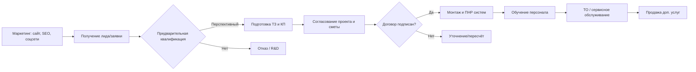

# Исполнительное резюме

В отчёте проанализированы компании и услуги в областях АПС, СОУЭ, СОТ, ОС, СКУД, КС (СКС), ЭОМ и ЭО. Под АПС понимается **Автоматическая пожарная сигнализация**, СОУЭ – **система оповещения и управления эвакуацией**, СОТ – **система охранного телевидения (видеонаблюдения)**, ОС – **охранная сигнализация**, СКУД – **система контроля и управления доступом**, КС – трактуется как **структурированные кабельные системы (СКС)**, ЭОМ – **система внутреннего электроосвещения и силового оборудования**, ЭО – **система внутреннего электроосвещения**. Для каждой области выявлены ключевые игроки (в основном российские интеграторы и производители). В таблице 1 приведены основные компании, их размеры, услуги и сайты.

Анализ маркетинговых стратегий (табл. 2) показывает, что компании используют сочетание **интернет-каналов** (SEO-контент, сайты с калькуляторами и акциями, лид-формы), **PR/экспертного контента** (статьи, семинары, вебинары, кейс-стади) и **сетевого маркетинга** (партнёрские сети, CRM, соцсети). Так, «Болид» акцентирует экспертное позиционирование (форум, обучение, презентации), Alodis – продвижение через технические статьи и акции, «Альянс Комплексная безопасность» – через спецпредложения, расчёты и соцсети (VK, Telegram)【51†L85-L94】【42†L74-L82】. Типичная воронка продаж построена по принципу «лидогенерация → квалификация → техническое задание → проект → монтаж → обслуживание». В качестве показателей эффективности используют число лидов, конверсию в договор и повторные продажи (контракты ТО).

На основе собранных данных спроектирована **интеграционная модель** (см. рис. 1–2). Модель связывает маркетинговые и операционные каналы: от привлечения лида через сайт и соцсети, до передачи заказа на монтаж и сервисный центр. Потоки данных охватывают CRM/ERP-систему, систему управления контентом сайта, модули расчёта смет, а также системы контроля качества и аналитики (BI). Наряду с типовой цепочкой «маркетинг – продажи – монтаж – обслуживание», предложена схема интеграции через единый CRM, общие KPI для партнёров и цифровую платформу обмена заявками.

В отчёте подробно рассмотрены **услуги компаний, их ценовые модели и примеры работ**. Так, помимо основных систем безопасности (АПС, СОУЭ, СКУД, СКС, видеонаблюдение), крупные игроки предлагают проектирование разделов ЭОМ/ЭО в составе инженерного проекта (см. [20]【20†L80-L88】). Компании обобщают предложения в «комплексные решения» и тарифы на обслуживание (например, единые договоры на ТО пожарной и охранной техники). Приводятся примеры реализованных проектов (Lotte Plaza, Skolkovo, корпоративные кампусы) у компаний «Альянс Комплексная безопасность»【51†L132-L140】 и др. Информация о ценах в открытом доступе ограничена: часть фирм публикует прайс-листы (для проектных и сервисных услуг), большинство формирует индивидуальные коммерческие предложения (см. [44]).

В заключении даны **рекомендации** по повышению эффективности лидогенерации и выстраиванию единой платформы взаимодействия провайдеров. Основные предложения: централизованная CRM/маркетинговая платформа, контент-стратегия (технические публикации, вебинары), совместное использование аналитики (общая BI-система), стандартизация процессов (единые шаблоны договоров, SLA) и активизация digital-продвижения (SEO/контекст, соцсети). Также предложен интеграционный «чертёж» взаимодействия служб (см. диаграмму рис. 2), обеспечивающий передачу лида от маркетинга к монтажникам через единый канал данных.

# Компании и сервисы по аббревиатурам

| Аббревиатура / Интерпретация                   | Примеры компаний (страна, размер, услуги)                                                                                                                                                                                                                                                                                                                                                                                                                                                                 | Сайт и источник                                                                      |
| ---------------------------------------------- | --------------------------------------------------------------------------------------------------------------------------------------------------------------------------------------------------------------------------------------------------------------------------------------------------------------------------------------------------------------------------------------------------------------------------------------------------------------------------------------------------------- | ------------------------------------------------------------------------------------ |
| **АПС** (пожарная сигнализация)                | • **Болид** (Россия, крупная компания–производитель, интегратор; проектирование, производство и монтаж АПС/ОПС, СКУД, СОУЭ, видеонаблюдения)【57†L7-L10】【25†L84-L93】. <br> • **Альянс «Комплексная безопасность»** (Россия, ~25 лет на рынке; проектирование и монтаж АПС, противопожарных АУП, СОУЭ, ОПС, СКУД, СКС, видеонаблюдения)【51†L94-L101】【51†L116-L124】. <br> • **AFESPRO** (Россия, ≈15 лет; производство и монтаж газовых/водяных установок пожаротушения и систем АПС)【32†L82-L87】. | bolid.ru【57†L7-L10】<br>complex-safety.com【51†L94-L101】<br>afes.pro【32†L82-L87】 |
| **СОУЭ** (оповещение/управление эвакуацией)    | • **Болид** (АСУВЭ на базе АПС «Орион», производство СОУЭ)【57†L7-L10】. <br> • **Alodis** (СПб, интегратор; проектирование и монтаж СОУЭ вместе с АПС, СКУД, видеонаблюдением)【36†L93-L101】. <br> • **Альянс «КБ»** (комплексные системы ОПС и СОУЭ, включая оповещение по ГОСТ)【51†L94-L101】【51†L116-L124】.                                                                                                                                                                                       | alodis-spb.ru【36†L93-L101】<br>complex-safety.com【51†L94-L101】                    |
| **СОТ** (охранное телевидение)                 | • **Болид** (видеосистемы «Орион», интеграция с СКУД/ОПС)【57†L7-L10】. <br> • **RINA** (Россия, с 1996; системы безопасности: охранное ТВ, СКУД, сигнализация)【53†L33-L41】. <br> • **Альянс «КБ»** (цифровое видеонаблюдение и домофония, интеграция с СКУД)【51†L94-L101】【51†L116-L124】.                                                                                                                                                                                                           | rina.pro【53†L33-L41】<br>complex-safety.com【51†L94-L101】                          |
| **ОС** (охранная сигнализация)                 | • **Болид** (охранная сигнализация «Болид», линейка СОС)【57†L7-L10】. <br> • **Альянс «КБ»** (комплексные ОПС/СКУД/Видеонаблюдение)【51†L94-L101】. <br> • **Alodis** (монтаж периметральной охранной сигнализации, интеграция с СКУД/СКС)【36†L93-L101】.                                                                                                                                                                                                                                               | bolid.ru【57†L7-L10】<br>complex-safety.com【51†L94-L101】                           |
| **СКУД** (контроль доступа)                    | • **Болид** (СКУД «ORION CD», контроллеры доступа)【57†L7-L10】. <br> • **RINA** (контроль доступа, домофония)【53†L33-L41】. <br> • **Альянс «КБ»** (СКУД, турникеты, шлагбаумы)【51†L75-L84】【51†L116-L124】. <br> • **Alodis** (монтаж СКУД, интеграция с ПО УРВ 1С)【36†L93-L100】.                                                                                                                                                                                                                  | rina.pro【53†L33-L41】<br>alodis-spb.ru【36†L93-L100】                               |
| **КС (СКС)** (структурированные сети)          | • **Alodis** (монтаж СКС, кабельные сети при внедрении СКУД/видеонаблюдения)【36†L103-L111】. <br> • **Альянс «КБ»** (ЛВС и СКС для систем безопасности)【51†L75-L84】. <br> • **RINA** (электросвязь, промышленное телевидение, IP-сети)【53†L33-L41】.                                                                                                                                                                                                                                                  | alodis-spb.ru【36†L103-L111】<br>rina.pro【53†L33-L41】                              |
| **ЭОМ** (сеть электрооборудования и освещения) | • Инжиниринговые компании (проектирование электроснабжения: «Энерджи Системз» и др.)【20†L80-L88】. <br> • Отдельные фирменные отделы интеграторов (при комплексном проекте АСУ).                                                                                                                                                                                                                                                                                                                         | –                                                                                    |
| **ЭО** (электроосвещение)                      | • Проектные организации (раздел «ЭО» в электропроектах)【18†L0-L8】. <br> • Энергоаудиторы и подрядчики «со светом».                                                                                                                                                                                                                                                                                                                                                                                      | –                                                                                    |

Таблица 1. Основные компании по направлениям (столбец «размер» – оценка уровня: «крупная» ≈ сотни сотрудников и партнёров, «средняя» ≈ десятки). Источники уточняют профили организаций【57†L7-L10】【51†L94-L101】【53†L33-L41】.

# Маркетинговые стратегии и каналы лидогенерации

Компании в рассматриваемых областях ориентированы на B2B-сегмент (корпоративные клиенты) и используют следующий набор маркетинговых инструментов:

- **Сайт и контент-маркетинг.** Практически все игроки поддерживают информативный сайт с подробным описанием услуг (проектирование, монтаж, обслуживание), калькуляторами смет и формами обратной связи. Например, «AFESPRO» предлагает рассчитать стоимость оборудования пожаротушения онлайн【32†L84-L87】, Alodis – смету монтажа по заявке (акции через сайт)【43†L74-L82】. Публикация технических статей (блоги) – важный канал (Alodis ведёт рубрики «Пожарная сигнализация», «СКУД» и др. с подробными статьями)【42†L74-L82】.

- **Социальные сети и медиа.** Крупные компании создают страницы в Telegram/VK/YouTube. Так, «Альянс Комплексная безопасность» рекламирует спецпредложения и публикует новости в собственных соцсетях【51†L85-L94】. Bolid ведёт форум и YouTube-канал (вебинары «Семинары Болид»【41†L133-L142】), что помогает привлечь инженерную аудиторию.

- **Обучение и PR.** Семинары, онлайн-курсы и вебинары повышают узнаваемость: у Bolid – программа «Семинары Болид», у Alodis – открытые вебинары и практикумы【41†L135-L142】. Публикация кейс-стади и новостей о крупных проектах (например, обслуживание Лотте Плаза, Сколково у «Альянс КБ»【51†L132-L140】) усиливает экспертный имидж.

- **Прямые продажи и партнёрство.** Клиентам часто делают персонализированные коммерческие предложения. Компании сотрудничают с интеграторами и дилерами. У Bolid есть партнёрская сеть (пультовые охраны) и каталог монтажных организаций. Также используются выездные консультации и демо-показы на объектах (бесплатный выезд инженера – как у московских фирм【32†L133-L142】).

- **Реклама.** Помимо SEO (оптимизация сайта под запросы типа «установка пожарной сигнализации»), многие используют контекстную рекламу, участие в отраслевых выставках и платную публикацию на сайтах-рейтингах (как материал на KP.ru【32†L77-L85】).

В табл. 2 сведены ключевые подходы и каналы у разных компаний. Основными KPI являются число лидов, конверсия (лид→договор), длительность цикла сделки, а также удержание и допродажи по ТО/сервису.

| Компания                              | Каналы и инструменты маркетинга                                                                                                                                                                                                                                                                                                    | Основные KPI и тактика лидогенерации                                                                                                                                                                                 | Примеры тактик                                                                                                                                                                                                                                     |
| ------------------------------------- | ---------------------------------------------------------------------------------------------------------------------------------------------------------------------------------------------------------------------------------------------------------------------------------------------------------------------------------- | -------------------------------------------------------------------------------------------------------------------------------------------------------------------------------------------------------------------- | -------------------------------------------------------------------------------------------------------------------------------------------------------------------------------------------------------------------------------------------------- |
| **Болид** (НВП «Болид»)               | – Сайт с каталогом решений (Орион: АПС, ОПС, СКУД, видеонаблюдение)【57†L7-L10】; форум партнёров, обучающие курсы, семинары【41†L133-L142】. <br> – Публикации в СМИ и на сайте «Статьи и презентации». <br> – Сертификации и участие в стандартах (имидж лидера).                                                                | KPI: зарегистрированные интеграторы, число семинаров/участников, трафик сайта. <br> Стратегия: выводить экспертов на тренинги, наращивать контент и партнерскую сеть.                                                | – Брендирование «Orion» (1,5 млн объектов)【57†L7-L10】. <br> – Бесплатные тренинги для специалистов. <br> – PR-материалы о новых продуктах (РИП, видеокамеры).                                                                                    |
| **Alodis** (СПб)                      | – Спецсайт с примерами решений (офис, склад, частный дом), калькулятор стоимости монтажа. <br> – Блог/статьи по темам АПС, СКУД, видеонаблюдение【42†L74-L82】. <br> – Рассылки по базе клиентов, участие в тендерах. <br> – Акции «со скидкой» на сайте【43†L74-L82】.                                                            | KPI: заявки с сайта, % конверсии звонок→смета, средний чек проекта. <br> Тактика: промо-акции (скидка 10% за заявку онлайн【43†L74-L82】), формирование предложений «под ключ».                                      | – Публикация часто задаваемых вопросов (FAQ). <br> – Онлайн-калькулятор (подсчёт работ). <br> – Акции «скидка на ТО» и «расчет стоимости проекта»【51†L62-L71】【43†L74-L82】.                                                                     |
| **Альянс «Комплексная безопасность»** | – Корпоративный сайт с яркими баннерами акций (скидки на датчики, распродажа, ТО)【51†L24-L33】【51†L47-L55】. <br> – Калькулятор проектной сметы (пожарные системы)【51†L62-L67】. <br> – Статьи «Наши объекты» с подробностями проектов (Сколково, Лотте)【51†L132-L140】. <br> – Активные соцсети (VK, Telegram)【51†L85-L94】. | KPI: рост базы заказчиков, % подписавшихся на ТО, количество обращений через соцсети. <br> Тактика: массовый захват контента (новостной блог, соцсети) и «крест-тейкинг» (обслуживание после монтажа как допродажа). | – «25 лет на рынке, лидер по комплексному обслуживанию»【51†L116-L124】. <br> – Спецпредложения («ТО от 3000₽/мес», «5% на датчики»)【51†L47-L55】. <br> – Расчёт стоимости и быстрые отклики (форма «Вопрос специалисту» на сайте)【51†L85-L94】. |
| **AFESPRO**                           | – Сайт–конфигуратор стоимости газ/воды систем пожаротушения【32†L84-L87】. <br> – Публикации отзывов/кейсов (Пятерочка, Ростелеком, Сбер)【32†L82-L87】. <br> – Акцент на собственном производстве.                                                                                                                                | KPI: заявки на расчет, заказы на системы, длительность цикла. <br> Стратегия: демонстрировать крупные объекты и брендов-партнёров, продвигать «своё производство» как преимущество.                                  | – Открытые цены на сайте (анкетирование)【32†L84-L87】. <br> – Отзывы ключевых клиентов (СБЕР, РТ, «Пятёрочка»)【32†L82-L87】.                                                                                                                     |
| **RINA**                              | – Сайт-портал с широким спектром (автоматизация, ИТ, безопасность)【53†L33-L41】. <br> – Раздел «Цены» с типовыми прайс-листами на разработку проектов безопасности. <br> – Кейсы (монтаж систем автоматизации).                                                                                                                   | KPI: число лидов из раздела «Безопасность», % конверсия запрос→коммерческое предложение. <br> Тактика: публикация таблиц цен (прозрачность)【54†L19-L22】, участие в отраслевых выставках.                           | – Представление ответов «F.A.Q.» и отзывов (доверие). <br> – Цены на сайте (частично закрыты, но есть примерные)【54†L19-L22】.                                                                                                                    |

Таблица 2. Сравнение маркетинговых стратегий и каналов лидогенерации (источники: корпоративные сайты компаний【41†L133-L142】【51†L85-L94】【43†L74-L82】 и отраслевые обзоры【32†L82-L87】).

# Бизнес-процессы и интеграционная система

Типовой бизнес-процесс интегратора систем безопасности включает этапы:

1. **Лидогенерация и квалификация.** Клиент оставляет заявку на сайте или звонит. Менеджер уточняет задачи, технические требования и бюджет.
2. **Подготовка предложения.** Инженеры разрабатывают ТЗ, готовят коммерческое предложение (аппендируются расчёты оборудования, трудозатрат). Клиент согласовывает проект и смету.
3. **Подписание контракта.** Заключается договор на проектирование/монтаж/обслуживание.
4. **Реализация проекта (монтаж и ПНР).** Физическая установка оборудования (АПС, СКУД, камер и т.д.), пуско-наладочные работы, интеграция систем, инструктаж пользователя.
5. **Техобслуживание и допродажи.** После сдачи объекта заключают договор сервисного обслуживания (ТО), периодически проводят проверку системы, уточняют дополнительные потребности (например, расширение видеосистемы или подключение новых ключей доступа).

Внутри компании-подрядчика эти этапы реализуются через CRM-систему: заявки из сайта попадают в CRM, где менеджеры фиксируют коммуникации и сроки, а проектировщики/монтажники получают задачи через интегрированный планировщик.

На рис. 1 показана схема типового процесса продаж и выполнения заказа интегратором.



_Рис. 1. Типовой бизнес-процесс интегратора систем безопасности (лидогенерация → проект → монтаж → сервис)._

Для интеграции маркетинга и операций между разными провайдерами предложена унифицированная архитектура (рис. 2). В ней важными элементами являются **единая CRM/ERP-платформа** и **обменный шлюз данных** (API/ESB) между участниками. Схема включает:

- **Центр маркетинга и аналитики.** Отвечает за сбор лидов (CRM) и их анализ (BI-система, воронка продаж, автоматизация e-mail). Лиды поступают из веб-формы, соцсетей, выставок.
- **Sales/AM-отдел.** Менеджеры используют CRM-данные для обработки запросов и формирования предложения; они передают подтверждённые заказы в проектный отдел.
- **Проектирование и монтаж.** Инженеры из ERP видят историю клиента и задачи монтажа; по завершении работы они фиксируют статус установки.
- **Сервис/поддержка.** После ввода в эксплуатацию система передаёт заявку на ТО сервисному центру. Производится учёт гарантий, планы обслуживания, обновление CRM (отзывы, реферальные контакты).

```mermaid
flowchart TD
    subgraph LeadToSale [Маркетинг и продажи]
        M[Сайт / SEO / SMM / Рекламные кампании]
        M --> CRM[CRM/маркетинг-платформа]
        CRM --> S[Менеджер продаж]
    end
    subgraph SaleToOper [Проект и монтаж]
        S --> PM[Служба проектирования]
        PM --> Install[Монтажники/подрядчики]
    end
    subgraph PostSale [Обслуживание и аналитика]
        Install --> Service[Сервисный центр (ТО)]
        Service --> CRM
        CRM --> BI[Аналитика / BI]
    end
    style LeadToSale fill:#f9f,stroke:#333,stroke-width:1px
    style SaleToOper fill:#ff9,stroke:#333,stroke-width:1px
    style PostSale fill:#9ff,stroke:#333,stroke-width:1px
    CRM --> BI
    BI --> M
```

_Рис. 2. Интеграционная система: сквозные потоки от лидогенерации к монтажу и последующему обслуживанию через общую CRM/ERP и аналитику._

Данная схема обеспечивает сквозную видимость клиента: от момента входящего звонка или заявки (через CRM/маркетинг) до статистики по выполненным объектам и повторным договорам обслуживания (через ERP/BI). Она позволяет синхронизировать KPIs (например, время отклика, скорость закрытия сделки, удовлетворённость клиента) между различными подразделениями и разными подрядчиками (компаниями-интеграторами).

# Анализ сервисов, кейсов и ценовых моделей

Компании предлагают весь цикл услуг: **консалтинг → проектирование → поставка оборудования → монтаж → интеграция → послепродажное обслуживание**. Обобщённая таблица 3 сравнивает ключевые элементы предложений у лидеров рынка.

| Компания (примеры)     | Основные услуги и продукты                                                                                                                                                                                                          | Примеры проектов/кейсов                                                                                                                                                       | Модель ценообразования и прайсинг                                                                                                                                                                                                                                 |
| ---------------------- | ----------------------------------------------------------------------------------------------------------------------------------------------------------------------------------------------------------------------------------- | ----------------------------------------------------------------------------------------------------------------------------------------------------------------------------- | ----------------------------------------------------------------------------------------------------------------------------------------------------------------------------------------------------------------------------------------------------------------- |
| **Болид**【57†L7-L10】 | Производство линейки «Орион» (консолей, датчиков, видеоконтроллеров); проектирование комплексных АПС/ОПС, СКУД, видеонаблюдения. Внедрение интегрированной системы «Орион» во множестве объектов (от банков до метро).              | На сайте представлены «Внедрённые проекты» (объекты на карте) – коммерческие здания, ТРЦ, АЗС (детали не публикуются открыто).                                                | Оборудование продаётся по прайс-листам; услуги проектирования и монтажа – по договору. Цен в открытом доступе нет. Цены на техническое обслуживание согласовываются отдельно (гарантия 1–3 года).                                                                 |
| **Alodis** (СПб)       | Инжиниринг и монтаж слабых токов: АПС, СОУЭ, СКУД, видеонаблюдение, периметральная ООС, СКС. Выводит на рынок интегрированные решения для офисов/промышленных объектов. Обслуживает системы безопасности.                           | Кейс-описания отсутствуют на сайте, но компания отмечает «300+ реализованных объектов»【36†L147-L155】. Типовые заказчики: торговые сети, офисные центры.                     | Прайс-листов на сайте нет. Расчёт стоимости ведётся по смете (по проекту). Акции: 10% скидка при заявке с сайта【43†L74-L82】, бесплатный первый месяц ТО при подписке.                                                                                           |
| **Альянс «КБ»**        | Проектирование и монтаж: пожарная автоматика (АПС, АУПТ, противопожарное водоснабжение), ОПС, СОУЭ, СКУД, видеонаблюдение, шлагбаумы/турникеты. Полный комплекс «под ключ» с оборудованием иностранного и российского производства. | Примеры проектов: обслуживание противопожарных систем ЖК «Лотте Плаза», бизнес-центр «Сколково», кампус «Летово», офисы РосДорБанка и др. (описано на сайте)【51†L132-L140】. | На сайте есть спецпредложения (ТО от 3000 руб/мес, скидки на оборудование)【51†L47-L55】. Публичные цены не раскрыты, расчёт – по формуле калькулятора (проектирование)【51†L62-L70】 или индивидуально. Заключаются контракты «под ключ» с фиксированной суммой. |
| **AFESPRO**            | Автоматические установки газового/водяного/порошкового пожаротушения и системы АПС. Собственное производство газовых модулей и насосов. Работает преимущественно с крупными компаниями (торговля, банки).                           | Упоминает в рейтингах такие заказчики, как «Сбер», «Ростелеком», «Пятёрочка»【32†L82-L87】. Реализованы проекты на складах и ТЦ (конкретных описаний нет).                    | На сайте имеется калькулятор оценки цены системы; действует прайс-лист оборудования. Проектные и монтажные работы оцениваются индивидуально (из анкет). Часто работает по 50% авансу.                                                                             |
| **RINA**               | Консалтинг и интеграция: системы ОПС/СОТ/СКУД (включая IP-решения), автоматизация и ИТ-инфраструктура. Разработка собственных решений по СКС и промышленным сетям.                                                                  | На сайте – разделы «Наши работы», отзывы. Крупные проекты: автоматизация и безопасность на промышленных объектах (детали по запросу).                                         | Имеются прайс-листы на проектирование (примерно 50–70 тыс. руб. за проект типового офиса). Монтаж и сервис по договору. Интегратор гибок в ценообразовании, ориентируется на объем.                                                                               |

Таблица 3. Сравнение предложений компаний: услуги, реализованные проекты, ценообразование (информация из сайтов и обзоров【51†L132-L140】【32†L82-L87】).

**Услуги и кейсы.** Во всех компаниях прослеживается полный цикл от проектирования до обслуживания систем безопасности. Например, Alodis подчёркивает «аутсорсинг пожарной безопасности» и «аудит систем»【36†L95-L103】, позволяя клиентам оптимизировать действующие системы. «Альянс КБ» в кейсах отмечает не только монтаж, но и последующее ТО (пр. «приступили к обслуживанию»【51†L134-L142】). Крупные интеграторы часто демонстрируют проекты в виде галерей или описаний (см. «Наши объекты» у «Альянс КБ»【51†L132-L140】).

**Ценообразование.** Одной из особенностей рынка является редкое публичное размещение цен: цены оборудования зашиты в каталоги, а услуги рассчитываются на основании проекта. Многие фирмы предлагают примерные ориентиры (калькуляторы стоимости проектирования【51†L62-L70】, прайс-листы технических работ). Дополнительным сервисом является продажа договоров ТО по фиксированной абонплате (от нескольких тысяч рублей в месяц).

# Рекомендации и интеграционный план

1. **Единая платформа CRM/маркетинг.** Рекомендуется внедрить общую CRM-систему (на уровне интегратора или отраслевого объединения), в которой аккумулируются все заявки, контакты и история клиентов. Это позволит нескольким компаниям (проектантам, монтажникам, сервисам) работать над одним портфелем заказов, обмениваться данными и синхронизировать продажи/обслуживание.

2. **Цифровая воронка продаж.** Автоматизация этапов воронки: от лидов (сайт, обзоры) до контракта. Необходимы электронные формы для онлайн-запросов (как у Alodis и AFESPRO), электронная подпись документов, мобильные приложения для монтажников. Так будут снижены потери лида при передаче между отделами.

3. **Контент-маркетинг и SEO.** Активизировать публикацию технических статей, кейсов и обучающих материалов. Качественный контент в поиске привлекает целевых клиентов (например, контент Alodis и Alfaludy «О промышленных системах безопасности»). В том числе, создать единую базу знаний и видеоматериалов (семинары) – объединённый ресурс отрасли.

4. **Координация каналов.** Согласовать ключевые метрики (KPI) между компаниями: скорость реакции на лид, сроки проектирования, уровень удовлетворённости. Проводить совместный анализ эффективности рекламных каналов (Google Ads, Яндекс, соцсети). Применять CRM-отчёты о сделках и бюджетах для совместной работы.

5. **Интеграция IT-систем.** Предложена интеграционная архитектура (см. рис. 2). Ключевым элементом является API-обмен между CRM, BI и операционными системами (программы учёта объектов, ERP). Например, при закрытии заказа CRM автоматически генерирует техническое задание в системе проектирования, а сервисная служба получает уведомление из той же CRM об оказанных услугах (замкнутый цикл данных).

6. **Повышение эффективности лидогенерации.** Изучить возможности B2B-маркетплейсов и платформ (например, разметка услуг на «ВсеИнженеры» или «ПромГуру»). Внедрить e-mail-маркетинг и ретаргетинг по базе клиентов (уведомления о проверках МЧС, акциях на техобслуживание). Использовать CRM для оценивания LTV (дохода за время обслуживания заказчика).

```mermaid
flowchart LR
    A[Заявка с сайта/выставки] --> B[CRM/маркетинг-платформа]
    B --> C[Менеджер отдела продаж]
    C --> D[Расчет/Проектирование]
    D --> E[Договор и монтаж]
    E --> F[Формирование акта сдачи]
    F --> G[Ввод в эксплуатацию]
    G --> H[Договор ТО]
    H --> I[Сервисный центр]
    I --> J[Сбор обратной связи]
    J --> K[BI-аналитика и отчёты]
    B --> K
    K --> C
    style A fill:#fffcf0,stroke:#333,stroke-width:1px
    style K fill:#f0fffa,stroke:#333,stroke-width:1px
```



_Рис. 3. Интеграционная модель процессов: данные от лидов через CRM передаются по этапам «продаж–монтаж–сервис», а общая BI-система обеспечивает аналитику и обратную связь._

**Прозрачность и стандарты.** Рекомендуется распространить практику открытых прайс-листов и шаблонных договоров. Например, опубликовать тарифы типовых пакетов обслуживания (как у AFESPRO) и базовые нормы монтажа (по сметникам МЧС). Это ускорит согласование условий и повысит доверие клиентов (сокращая циклы проверки коммерческих предложений).

В совокупности, создание **единых цифровых платформ**, **обмен данных по API** и **координация маркетинговых кампаний** между провайдерами позволит сократить издержки на привлечение клиентов и увеличить конверсию из первого контакта в контракт. Такой интеграционный «чертёж» процессов обеспечит гладкий путь клиента от первого клика до долгосрочного обслуживания.

**Источники:** Официальные сайты компаний и отраслевые публикации【57†L7-L10】【51†L94-L101】【32†L82-L87】【53†L33-L41】, а также аналитика экспертов по маркетингу B2B (табл. 2, примеры практик)【32†L82-L87】【42†L74-L82】.
