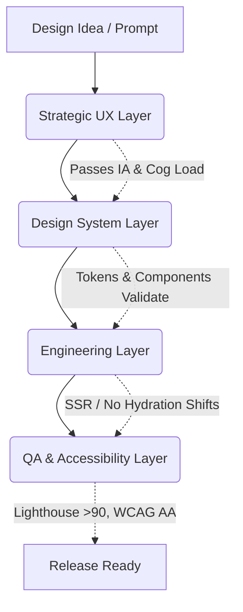

# ENTERPRISE UI/UX STRATEGIC GOVERNANCE

**Version:** 2.0  
**Scope:** Antigravity OS / Enterprise Web Architecture  
**Status:** 🟢 Active

---

## 📌 1. OVERVIEW & PHILOSOPHY

> [!IMPORTANT]
> **Depth over Breadth**
> Every interface system deserves to be engineered deeply. UI/UX is not just styling; it is an architectural discipline governed by strict rules, tokens, and measurable performance.

This document defines the systemic governance layers, routing logic, and Key Performance Indicators (KPIs) for building high-quality, conversion-oriented, and accessible interfaces.

---

## 🏛️ 2. CONTEXT-AWARE UX SOURCING

Depending on the task routing context (`configs/orchestrator/router.yaml`), the Design Agent must apply exactly one of the following architectural profiles:

### 2.1 Premium / Luxury (C3-C5 Tier)

- **Goal**: Brand trust, emotional engagement, high ticket conversion.
- **Priority Order**: 1. Apple HIG → 2. GSAP/Framer Motion discipline → 3. Laws of UX.
- **Characteristics**:
  - High negative space (minimal visual noise).
  - Strong typography hierarchy.
  - Micro-interactions (soft duration `180-220ms`, `cubic-bezier` easing).
  - Soft elevations and neumorphism (Deep Graphite / Glass).

### 2.2 Enterprise SaaS (C2-C4 Tier)

- **Goal**: Workflow efficiency, data density management, low cognitive load.
- **Priority Order**: 1. Material 3 / Carbon Design → 2. ISO 9241-210 → 3. WCAG 2.2 AA.
- **Characteristics**:
  - Predictable component architecture.
  - Keyboard-first navigation support.
  - High information density with clear boundaries (borders, subdued backgrounds).

### 2.3 E-Commerce / Conversion (Fast Path)

- **Goal**: Friction reduction, high CTR, fast checkout.
- **Priority Order**: 1. Baymard Institute → 2. Shopify Polaris → 3. WCAG A.
- **Characteristics**:
  - High contrast for primary CTAs (`contrast >= 4.5:1`).
  - Strict reliance on proven conversion patterns.
  - Trust signals (badges, reviews, secure checkout locks).

---

## 🧬 3. ARCHITECTURE OF GOVERNANCE

The UI System is governed by a 4-layer validation architecture to prevent drift, regressions, and accessibility violations.

### Layer 1: Strategic UX

- Information Architecture (IA) validation.
- Cognitive Load Index calculation.
- User Flow friction assessment.

### Layer 2: Design System (Tokens)

- **Zero Token Drift**: Absolute reuse of tailwind/css variables (`primary-600`, `radius-xl`, `shadow-soft`).
- Atomic Design composition adherence.
- Master template overrides matching `MASTER.md`.

### Layer 3: Engineering

- **Zero Hydration Layout Shifts** in React/Next.js.
- Strict Typescript bindings for all UI components.
- Optimization of asset loading (Fonts, Icons, WebP).

### Layer 4: Accessibility & Performance

- Full ARIA compliance.
- Reduced Motion support (`@media (prefers-reduced-motion)`).
- Core Web Vitals targets.

---

## 📊 4. MEASUREMENT & KPI FRAMEWORK

We do not trust "feelings"; we measure UI.

### 4.1 Core Web Vitals & Perf

| Metric                              | Threshold | Impact      |
| :---------------------------------- | :-------- | :---------- |
| **CLS** (Cumulative Layout Shift)   | `≤ 0.05`  | 🔴 Critical |
| **LCP** (Largest Contentful Paint)  | `< 2.0s`  | 🟡 High     |
| **INP** (Interaction to Next Paint) | `< 150ms` | 🟡 High     |
| **Lighthouse Score** (Perf)         | `≥ 95`    | 🟢 Medium   |

### 4.2 Cognitive Load Index (CLI)

Calculated by the UX Agent during code review:
`CLI = (Visual Density × 0.25) + (Interaction Steps × 0.25) + (Text Complexity × 0.20) + (Decision Points × 0.15) + (Motion Distraction × 0.15)`

- **Target Maximums**:
  - Luxury/Premium: `< 35` (Hyper-minimal)
  - E-Commerce: `< 45`
  - Enterprise Dashboards: `< 60`

### 4.3 Conversion Score (CS)

For landing pages and funnels:
`CS = (CTA Vis/Contrast × 0.30) + (Friction Reduction × 0.30) + (Trust Signals × 0.20) + (Clarity × 0.20)`

- **Target**: `≥ 85/100` before production approval.

---

## 🤖 5. MULTI-AGENT ORCHESTRATION (THE UI SWARM)

For complex T6 (Design) or C4/C5 tasks, the UI Swarm is activated.

1. **Strategic UX Agent (DeepSeek R1)**: Defines the IA, establishes the token requirements, calculates CLI/CS targets. Output: `UX_SPEC.md`.
2. **UI System Agent (DeepSeek V3 / Sonnet)**: Implements the Tailwind/React code using the design system. Ensures token compliance.
3. **Accessibility & Review Agent (Mistral Small / Gemini Flash)**: Runs the strict Quality Gate. Reviews contrast, ARIA, and mobile responsiveness.

**Release Checkpoint**:

- [ ] Has Token Drift occurred?
- [ ] Are animations linked to semantic triggers, not random loops?
- [ ] Is mobile tap-target size `≥ 44px`?
- [ ] Are hydration shifts fixed?
      If any fail ➔ Send back to UI System Agent (Ralph's Loop).

---

## ⚠️ 6. RISK REGISTER & TRADE-OFFS

| Anti-Pattern (Risk)                         | Governance Rule (Mitigation)                                                                           |
| :------------------------------------------ | :----------------------------------------------------------------------------------------------------- |
| **Over-animation** (CPU spike, distraction) | Motion discipline. No infinite loops without user interaction. Max 2 concurrent animations on screen.  |
| **Token Drift** (Hardcoded colors/px)       | Strict use of `#F4F6F9` ➔ `var(--bg-card)` or `bg-card`. CI checks for arbitrary hex codes in JSX.     |
| **Component Duplication**                   | UI Fast Path Exception: ALWAYS search `packages/design-system` / `src/components` before creating new. |
| **Hydration Layout Shift**                  | Isolate client state (`useClient`, skeletons) from server-rendered layouts.                            |

---

## 🔖 7. VERSIONING & UPDATES

- **MAJOR**: Structural UX overhaul, new design language (e.g., flat to deep graphite).
- **MINOR**: New components, new pages following existing rules.
- **PATCH**: Spacing tweaks, ARIA fixes, color adjustments.

> _End of Policy Specification. Read-only for Agents._
