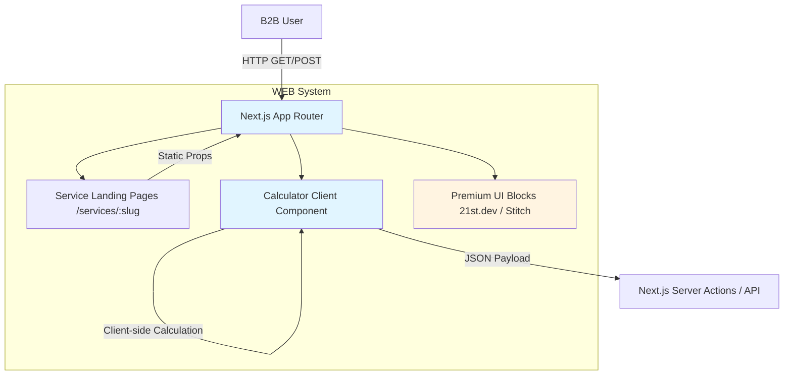
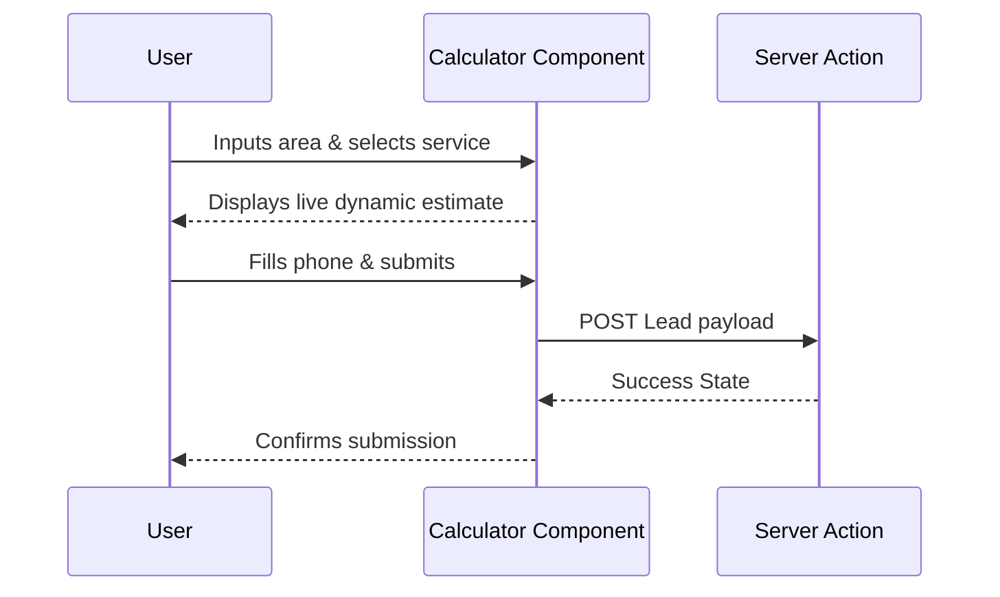

# WEB System Design Document

**System ID**: WEB
**Project**: Electromax
**Version**: 1.0
**Status**: Draft
**Author**: Antigravity Genesis
**Date**: 2026-02-24

---

## 1. Overview

### 1.1 System Purpose

To provide a highly interactive, extremely performant, and SEO-optimized B2B marketing website for Electromax engineering systems. It captures B2B leads by demonstrating expertise through cases, providing an interactive cost calculator, and clearly presenting services (APS, SOUE, SOT, etc.).

### 1.2 System Boundary

- **Input**: User interactions (Clicks, Form submissions on landing pages, Calculator dynamic inputs).
- **Output**: API calls to Next.js server actions / API routes (`/api/leads`).
- **Dependencies**:
  - 21st.dev UI components (Breadcrumb, Navigation Tabs, Dotted Surface, Pricing, Footer).
  - Stitch UI layout structures.
  - Next.js API Routes for backend handling.
- **Dependents**: None (End-user facing).

### 1.3 System Responsibilities

**Responsible for**:

- Server-Side Rendering (SSR) / Static Site Generation (SSG) of service landing pages.
- Client-side interactivity (Calculator logic, animations, form validation).
- Integration and rendering of premium UI components using Tailwind CSS.
- Initial lead data collection and validation.

**Not responsible for**:

- Finalizing CRM insertion (handled by backend integration).
- Storing long-term analytical data (handled by Yandex Metrika/Google Analytics).

---

## 2. Goals & Non-Goals

### 2.1 Goals

- **[G1]**: Achieve near-instant LCP (Largest Contentful Paint) < 1.5s via Next.js App Router (SSG).
- **[G2]**: Establish a high-conversion calculator form component that recalculates estimates in < 50ms locally.
- **[G3]**: Maintain 100% adherence to Stitch's provided UI design parameters for Engineering Security Integrator landing pages.

### 2.2 Non-Goals

- **[NG1]**: Building a full customer portal or dashboard. The system is strictly marketing and lead generation.

---

## 3. Background & Context

### 3.1 Why This System?

The company needs a distinct, premium digital presence to capture B2B engineering leads. The previous or non-existent solution is failing to provide a clear funnel.

**Related PRD Reqs**:

- [REQ-001] Landing Page Architecture
- [REQ-002] Interactive Cost Calculator
- [REQ-004] Component-Driven UI

### 3.2 Constraints

- **Performance**: Must pass Core Web Vitals (SEO requirement).
- **Tech Stack**: Must use Next.js, React 19, Tailwind CSS 4.
- **Visuals**: Must use "quiet luxury" / high-end B2B styling via 21st.dev components.

---

## 4. Architecture

### 4.1 Architecture Diagram



### 4.2 Core Components

| Component Name    | Responsibility                             | Tech Stack                       |
| ----------------- | ------------------------------------------ | -------------------------------- |
| `HeroBanner`      | Landing page entry with CTA and value prop | React, Tailwind, Stitch UI       |
| `CalculatorForm`  | Multi-step interactive estimator           | React (useActionState), Tailwind |
| `PricingSection`  | Display tier packages                      | React, 21st.dev Pricing Block    |
| `AnimatedNavTabs` | Service category switching                 | Framer Motion, 21st.dev          |
| `DottedSurface`   | Background aesthetic pattern               | SVG, 21st.dev                    |

### 4.3 Data Flow



---

## 5. Interface Design

### 5.1 Component Interface

#### 5.1.1 CalculatorForm Component [REQ-002]

**Props**:

```typescript
interface CalculatorFormProps {
  basePrice: number;
  serviceSlug: string;
  onLeadCapture: (payload: LeadPayload) => Promise<{ success: boolean; error?: string }>;
}

interface LeadPayload {
  objectType: "office" | "warehouse" | "retail" | "industrial";
  areaSquareMeters: number;
  complexityCoef: number;
  estimatedPrice: number;
  contactPhone: string;
}
```

---

## 6. Data Model

### 6.1 Data Structures

#### Service Configuration (Static JSON/MD)

```typescript
interface ServiceConfig {
  id: string; // e.g., 'aps', 'soue'
  title: string;
  description: string;
  basePricePerSqm: number;
  packages: PricingPackage[];
  includedSteps: ProcessStep[];
}
```

---

## 7. Technology Stack

### 7.1 Core Technologies

| Domain        | Choice                  | Rationale                                             |
| ------------- | ----------------------- | ----------------------------------------------------- |
| Framework     | Next.js 16 (App Router) | Best SEO, SSR/SSG, File-based routing                 |
| Styling       | Tailwind CSS v4         | Rapid utility-first component styling                 |
| UI Primitives | 21st.dev & Magic UI     | High-end visual impact, minimal boilerplate           |
| Animations    | Framer Motion           | Smooth interactions for Tabs and interactive elements |

---

## 8. Trade-offs & Alternatives

### 8.1 Decision 1: Next.js SSG vs SSR for Landing Pages

**Option A: SSG (Static Site Generation) (✅ Selected)**

- ✅ **Pros**: Lightning-fast TTFB (Time to First Byte), inherently scalable, cheap to host.
- ❌ **Cons**: Requires rebuild to update static pricing or text.
  **Option B: SSR (Server-Side Rendering)**
- ✅ **Pros**: Real-time content updates.
- ❌ **Cons**: Slower response times compared to pre-rendered HTML; overkill for rarely changing marketing copy.
  **Decision**: Use SSG. Marketing content for engineering systems changes infrequently. Lead forms will be handled by dynamic API endpoints unconditionally.

### 8.2 Decision 2: Context API vs Local State for Calculator

**Option A: Local State (useState/useReducer) (✅ Selected)**

- ✅ **Pros**: Keeps component isolated and perfectly portable.
- ❌ **Cons**: Harder to share state outside the bounds of the component.
  **Option B: Global State (Zustand / Redux)**
- ✅ **Pros**: Accessible anywhere.
- ❌ **Cons**: Massive overkill for a single-page calculator.
  **Decision**: Local state. The calculator data doesn't strongly affect global layout outside its direct container.

---

## 9. Security Considerations

### 9.1 Data Protection

- **XSS**: Handled naturally by React's DOM escaping.
- **CSRF**: Next.js Server Actions inherently validate origins.
- **Lead Spam**: Must implement invisible ReCaptcha v3 or Turnstile on the `CalculatorForm` to prevent bot spam.

---

## 10. Performance Considerations

### 10.1 Optimization Strategies

1. **Asset Optimization**:
   - Optimize all Stitch reference images using `next/image` with WebP format.
   - Serve `DottedSurface` natively as SVG rather than raster images.
2. **Bundle Size**:
   - Lazy-load heavy components (like 3D viewers or heavy map frames, if any) below the fold.

---

## 11. Testing Strategy

### 11.1 Component Testing

- **Tool**: Vitest + React Testing Library.
- **Scenarios**:
  - Calculator mathematical assertions (does basePrice \* area accurately calculate?).
  - Form validation blocks submission on invalid phone numbers.

### 11.2 End-to-End Testing

- **Tool**: Playwright.
- **Scenarios**:
  - Full critical path: User lands on page -> interacts with Tabs -> fills Calculator -> Submits Lead -> sees Thank You state.
