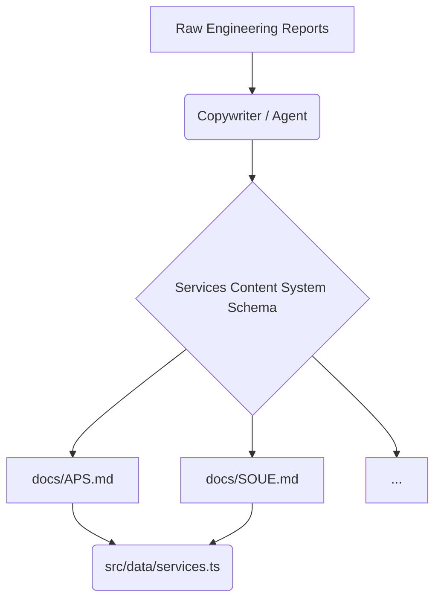

# System Design: Services Content System

## 1. Overview

The **Services Content System** defines the standard Markdown schema representing the marketing and engineering data for all engineering services (APS, SOUE, SOT, OS, SKUD, SKS, EOM, EO). This system acts as the single source of truth for the `src/data/services.ts` Next.js structured data block, ensuring consistent presentation across all dynamically generated service landing pages.

## 2. Goals & Non-Goals

**Goals:**

- Provide a unified, predictable Markdown structure for copywriting and content entry.
- Map 1:1 with the Electromax Frontend component architecture (HeroBanner, AnimatedTabs, CalculatorForm, PricingCards, etc.).
- Allow easy translation of dry engineering reports into marketing-friendly structures.

**Non-Goals:**

- Replacing the Next.js TypeScript data layer entirely (Markdown is for drafting/content approval, later parsed to TS).
- Handling CMS or database integrations in this phase.

## 3. Background & Context

Electromax generates leads through specialized landing pages. The PRD [REQ-001] dictates a universal landing page template. Engineering data in `docs/electrical_integrator_service_reports/` contains accurate pricing and scope but lacks marketing narrative (Problem cards, step-by-step processes, UI groupings).

## 4. Architecture (Data Schema)

The architecture is a standardized Markdown Frontmatter + Content Block schema.



## 5. Interface Design (The Markdown Schema)

Each service variant in `docs/<SERVICE_SLUG>.md` MUST adhere to the following schema:

```markdown
---
slug: "aps"
title: "Автоматическая пожарная сигнализация (АПС)"
shortName: "АПС"
basePrice: 450
complexity:
  office: 1.0
  warehouse: 1.2
  industrial: 1.5
---

## Hero (Экран 1)

- **Subtitle**: Проектирование, монтаж и обслуживание под ключ по нормативам МЧС.
- **Features**:
  - Лицензия МЧС
  - Сдача с 1 раза
  - Проект за 3 дня

## Problems (Когда требуется)

1. **Ввод в эксплуатацию**: Без АПС здание не пройдет проверку.
2. **Предписание**: Получили штраф и срок на устранение.
3. **Реконструкция**: Изменение планировки или назначения помещений.

## Process (Что входит в работу)

1. Аудит объекта
2. Разработка проекта
3. Монтаж оборудования
4. Пусконаладка и сдача

## Equipment (Состав системы)

- Дымовые извещатели
- Тепловые извещатели
- Ручные извещатели
- Прибор приемно-контрольный (ППКП)

## Pricing Packages (Пакеты)

| Пакет        | Цена (от)  | Описание                         |
| ------------ | ---------- | -------------------------------- |
| Базовый      | 45 000 ₽   | Для небольших офисов до 100 кв.м |
| Стандарт     | 150 000 ₽  | Для коммерческих объектов        |
| Промышленный | По запросу | Для заводов с интеграцией СОУЭ   |
```

## 6. Trade-offs & Alternatives

**Markdown vs JSON for Drafting:** JSON is strict and parses easily into TypeScript, but Markdown is much easier for humans and agents to read/write long-form text (like Problem descriptions and Hero copy). We chose Markdown for `docs/` variants to facilitate easy review, with a manual or scripted translation to `src/data/services.ts`.

## 7. Next Steps

Generate the 8 variant files mapping to this schema based on the documents within `docs/electrical_integrator_service_reports/`.
