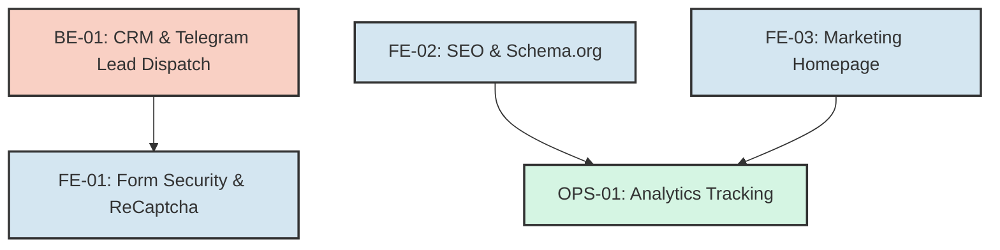

# Project Tasks & Execution Blueprint (WBS)

**Version**: 2.0 (Phase 6 Expansion)
**Project**: Electromax
**Generated By**: AntiGravity `/blueprint` Workflow

## Phase Overview

The initial foundation, data layers, UI building blocks, and rendering cycles (Phases 1-5) are complete.
The tasks below represent **Phase 6: Production Readiness & Marketing Expansion** for Electromax. This phase focuses on finalizing the backend lead flow, securing forms, building the global homepage, and optimizing for search engines and analytics.

---

## Task Dependency Graph

---

## Detailed Task List (WBS)

### Phase 6.1: Lead Flow & Security (Backend Focus)

- [x] **[BE-01] Implement Real Lead Dispatching (`/api/leads`)**
  - **Goal**: Replace mock API response with actual dispatching to a Telegram Bot and Email/SMTP.
  - **Input**: `WEB.md` & `PRD.md` [REQ-003].
  - **Output**: `src/app/api/leads/route.ts` updated with `node-telegram-bot-api` / `nodemailer` logic. Environment variables updated.
  - **Verification**: Submit a test lead on `/services/aps`; check external Telegram channel for receipt.
  - **Routing/Path**: `[T3][C4]` Swarm Path (Critical Integration).
  - **Dependencies**: None.

- [x] **[FE-01] Form Security (Turnstile / ReCaptcha)**
  - **Goal**: Prevent spam submissions on the Calculator and standard forms.
  - **Input**: `WEB.md` Security considerations.
  - **Output**: `src/components/forms/CalculatorForm.tsx` equipped with Turnstile/ReCaptcha token generation, Server Action verification in `/api/leads`.
  - **Verification**: Attempt to POST to `/api/leads` without a token and verify rejection (403/400).
  - **Routing/Path**: `[T2][C2]` Fast Path.
  - **Dependencies**: BE-01.

### Phase 6.2: Marketing Interface (Frontend Focus)

- [x] **[FE-02] Global SEO & Schema.org Integration**
  - **Goal**: Embed dynamic Meta titles, descriptions, and JSON-LD structured data for better indexing.
  - **Input**: `PRD.md` [REQ-005].
  - **Output**: `src/app/services/[slug]/page.tsx` utilizing `generateMetadata`. `<script type="application/ld+json">` appended to the layout.
  - **Verification**: `npm run build` succeeds, HTML source code confirms accurate JSON-LD syntax.
  - **Routing/Path**: `[T3][C2]` Fast Path.
  - **Dependencies**: None.

- [x] **[FE-03] Marketing Homepage (`/`)**
  - **Goal**: Create the root landing page introducing Electromax, linking to all 8 service hubs.
  - **Input**: `PRD.md` Universal Landing Page Template requirements.
  - **Output**: `src/app/(marketing)/page.tsx` utilizing `HeroBanner`, Home-specific features grid, and trusted partners block.
  - **Verification**: Visual QA check of `http://localhost:3000/`. Next.js routing must cleanly load without hydration errors.
  - **Routing/Path**: `[T6][C4]` Swarm Path (Design Lead focus for UI Layout).
  - **Dependencies**: None.

### Phase 6.3: Polish & Launch

- [x] **[OPS-01] Analytics Infrastructure**
  - **Goal**: Install Yandex Metrika and track key events (`form_submit`, `calculator_complete`).
  - **Input**: `PRD.md` [REQ-005].
  - **Output**: `src/components/Analytics.tsx` injected into `layout.tsx`. Event listeners added to `CalculatorForm.tsx`.
  - **Verification**: Check network tab for Yandex ping on form completion.
  - **Routing/Path**: `[T1][C1]` Fast Path.
  - **Dependencies**: FE-01, FE-03.

---

## Execution Strategy

**Parallel vs Sequential**:

- **BE-01**, **FE-02**, and **FE-03** can be executed **in parallel** as they touch separate domains (API routing, Metadata, and Homepage components).
- **FE-01** (Spam protection) should follow **BE-01** to avoid rewriting the API twice.
- **OPS-01** should happen last to ensure event hooks attach cleanly to the finalized UI components.

**Recommendation**: Activate Swarm Path for `BE-01` and `FE-03` simultaneously to drastically cut execution time.
