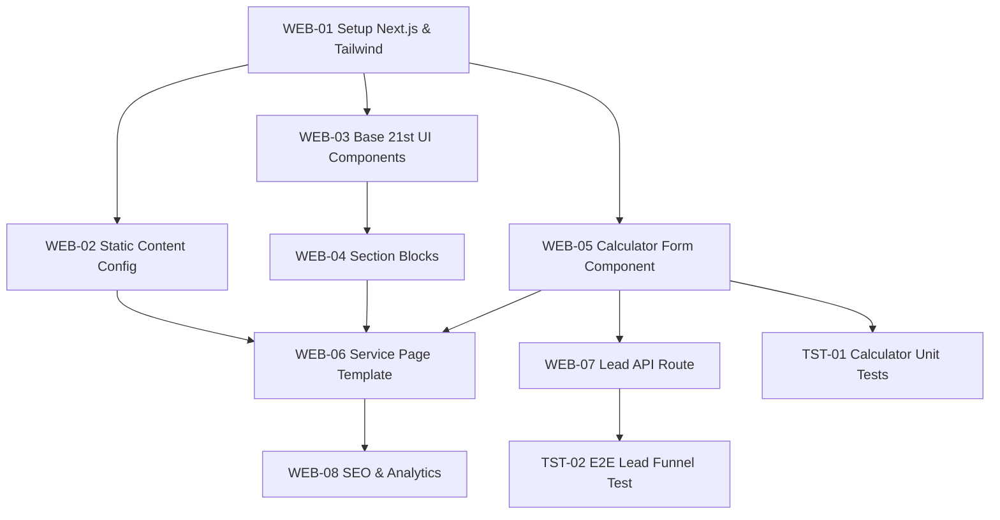

# 05_TASKS WBS (Work Breakdown Structure)

## Phase Overview

- **Phase 1: Foundation** (Next.js, Tailwind, Routing, Content/Data layer)
- **Phase 2: UI Building Blocks** (21st.dev elements, base Stitch UI atoms)
- **Phase 3: Core Features** (Calculator logic, Service Page Layouts)
- **Phase 4: Integrations** (API Lead Capture, Notifications, SEO)
- **Phase 5: Verification** (Unit and E2E Tests)

---

## Mermaid Dependency Graph

---

## Detailed Task List (WBS)

### Phase 1: Foundation

- [ ] **[WEB-01] Scaffold Next.js & Tailwind**
  - **Goal**: Initialize `/src/app`, configure Tailwind to match Stitch tokens.
  - **Input**: `04_SYSTEM_DESIGN/WEB.md`, `package.json`
  - **Output**: `tailwind.config.ts`, `globals.css`, root layout.
  - **Verification**: `npm run dev` starts successfully with Tailwind styling applied on page.
  - **Dependencies**: None

- [ ] **[WEB-02] Setup Content Data Layer**
  - **Goal**: Define TS interfaces and dummy content (pricing per sq.m, features) for the APS & SOT services.
  - **Input**: `04_SYSTEM_DESIGN/WEB.md` (Data Model)
  - **Output**: `src/data/services.ts`, `src/types/index.ts`
  - **Verification**: Types compile without TS errors.
  - **Dependencies**: [WEB-01]

### Phase 2: UI Building Blocks

- [ ] **[WEB-03] Implement Premium 21st UI**
  - **Goal**: Scaffold Breadcrumb, Animated Tabs, Dotted Surface, and Pricing Block templates sourced from 21st.dev.
  - **Input**: Links from 21st.dev (via Genesis info)
  - **Output**: `src/components/ui/Tabs.tsx`, `Breadcrumb.tsx`, `Pricing.tsx`, `DottedSurface.tsx`
  - **Verification**: Components render visually in an isolated page component placeholder.
  - **Dependencies**: [WEB-01]

- [ ] **[WEB-04] Implement Base Sections**
  - **Goal**: Build `HeroBanner`, `Footer`, `ProblemCards`, and `FAQAccordion` sections based on Stitch references.
  - **Input**: HTML downloaded to `stitch_screens/`
  - **Output**: `src/components/sections/HeroBanner.tsx`, etc.
  - **Verification**: Manual visual QA against Stitch exported HTML.
  - **Dependencies**: [WEB-03]

### Phase 3: Core Features

- [ ] **[WEB-05] Implement Interactive Calculator Form**
  - **Goal**: Build local-state driven dynamic form. Input area, output estimated price (basePrice _ Area _ Coef).
  - **Input**: `04_SYSTEM_DESIGN/WEB.md`
  - **Output**: `src/components/forms/CalculatorForm.tsx`
  - **Verification**: User input updates estimated price output instantly on screen.
  - **Dependencies**: [WEB-01]

- [ ] **[WEB-06] Build Service Landing Template**
  - **Goal**: Assemble components into the final dynamic `/services/[slug]` Next.js Route.
  - **Input**: `WEB-04` components, `WEB-05` form, `WEB-02` data
  - **Output**: `src/app/services/[slug]/page.tsx`
  - **Verification**: Navigating to `/services/aps` renders the fully assembled landing page with APS specific text.
  - **Dependencies**: [WEB-02], [WEB-04], [WEB-05]

### Phase 4: Integrations

- [ ] **[WEB-07] Create Lead Capture API**
  - **Goal**: Next.js route handler accepting POST. Logs output and mocks Telegram/CRM push.
  - **Input**: `01_PRD.md` (Lead Capture)
  - **Output**: `src/app/api/leads/route.ts`
  - **Verification**: API returns 200 Success when POSTing valid JSON payload; form on UI shows success state.
  - **Dependencies**: [WEB-05]

- [ ] **[WEB-08] Analytics & SEO Hooks**
  - **Goal**: Configure next/head or metadata exports. Hook fake analytics events to form submissions.
  - **Input**: `01_PRD.md` (SEO & Analytics)
  - **Output**: `src/lib/seo.ts`, updates to `app/layout.tsx`
  - **Verification**: Page source HTML contains `<title>`, `<meta description>`, and `<script type="application/ld+json">`.
  - **Dependencies**: [WEB-06]

### Phase 5: Verification

- [ ] **[TST-01] Calculator Unit Tests**
  - **Goal**: Ensure the pricing algorithms are mathematically bulletproof.
  - **Input**: `04_SYSTEM_DESIGN/WEB.md`
  - **Output**: `tests/unit/calculator.test.ts`
  - **Verification**: `npm run test` passes.
  - **Dependencies**: [WEB-05]

- [ ] **[TST-02] E2E Lead Funnel Test**
  - **Goal**: Playwright test asserting a user can view APS page, input data, and submit lead.
  - **Input**: `04_SYSTEM_DESIGN/WEB.md`
  - **Output**: `tests/e2e/lead-funnel.spec.ts`
  - **Verification**: playwright test passes headlessly.
  - **Dependencies**: [WEB-07]

---

## Execution Strategy

- Tasks WEB-03 and WEB-05 can be executed **in parallel** by separate agents (UI vs Logic).
- Phase 2 must strictly precede Phase 3 assembly.
- Phase 4 Integrations can be worked on concurrently with Phase 4 SEO.
